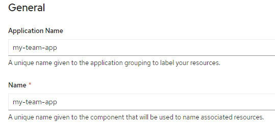

# Задание  агента UNDERCOVER

## (НЕ ИСПОЛЬЗОВАТЬ - СОВЕРШЕННО СЕКРЕТНО)

Это **приложение NodeJS** поможет новому агенту Undercover познакомиться с нашими системами.

Вам будет предоставлена вся необходимая информация, чтобы подключиться к секретной системе UnderCover Network System.

Разверните это приложение в RedHat Openshift cluster, работающем в IBM Cloud и откройте приложение в браузере.

### Тебе потребуется:

- Браузер
- Доступ к RedHat OpenShift Cluster в облаке IBM
- Эта ссылка на GitHub

## ИНСТРУКЦИЯ

- #### Залогиньтесь в IBM Cloud (https://cloud.ibm.com)
- #### Найдите ваш кластер Openshift

  - Кто-то сказал, что известный хакер "Alexander Gavrin" открыл свой аккаунт для всех.
    - Ты сможешь найти его аккаунт "под" своим именем (нажми на свое имя в консоли или [здесь](https://cloud.ibm.com/?bss_account=6c8f4926207a904b377aee72d8cd861e))
    - Если видишь клестер OpenShift, открой его (или нажми [тут](https://cloud.ibm.com/kubernetes/clusters/c19h9sjf0ecruimc5ngg/overview?region=eu-de&resourceGroup=799d42eab36346bdac7c23cf2c874c17&bss_account=6c8f4926207a904b377aee72d8cd861e))

- #### Открой консоль Openshift

  - Тебе нужно отключить  **блокировщики всплывающих окон**, так как откроется новая закладка в браузере
	- Первый раз кластер будет открываться долго - возможно, тебе понадобится закрыть окно, и открыть его заново ("Openshift web console")

- #### **В роли разработчика, <u>ВЫБЕРИ СВОЙ ПРОЕКТ</u> - не используй "default"**

  

- #### Создай свое приложение NodeJS **FROM GIT** используя ссылку на этот репозиторий

  - Скопируй URL этого репозитория

  - Проверь, что builder image выбран правильно - **NodeJS**

  - **<u>Измени</u>** имя приложения - оно должно быть уникально

      

  - Нажми **Create** 

    - Несколько минут - и твое приложение будет развернуто
		- Посмотри в логи - там видно что происходит

#### Как только приложение развернуто (зеленая галочка, синий кружок), нажми на Open URL

#### Сгенерируй код, который тебе будет необходим для получения приза

**<u>ВЫ ВЫПОЛНИЛИ ЗАДАНИЕ!!!</u>**

